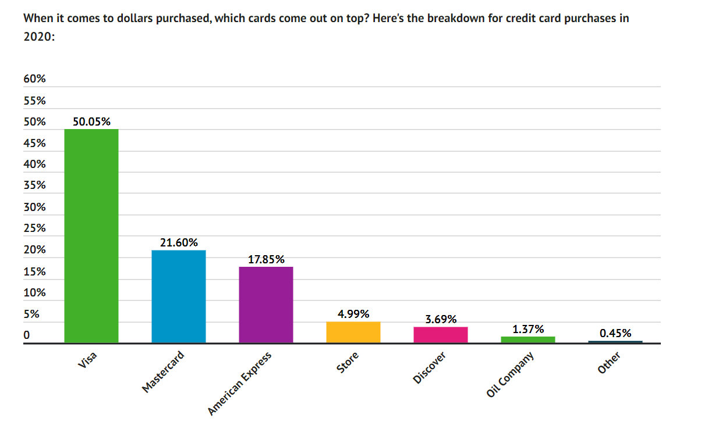
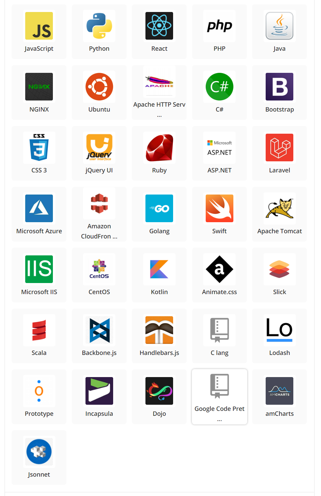
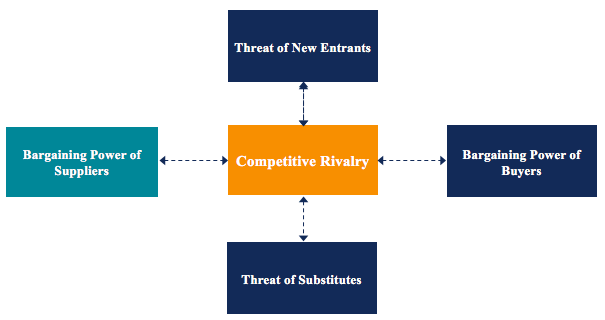

# Mastercard Dynamic Currency Conversion: a Case study

## Table of Contents

- 1. [Overview and Origin](#OverviewandOrigin)
- 2. [The Scope of This Document](#TheScopeofThisDocument)
- 3. [Business Activities](#BusinessActivities)
  - 3.1. [The market share](#Themarketshare)
  - 3.2. [Current Competitive Advantages](#CurrentCompetitiveAdvantages)
  - 3.3. [Current Tech Stack](#CurrentTechStack)
- 4. [Landscape](#Landscape)
  - 4.1. [Competitors](#Competitors)
- 5. [Results](#Results)
- 6. [Recommendation](#Recommendation)
- 7. [References](#References)

## 1. Overview and Origin

In 1966 a group of banks formed a member-owned Interbank Card Association (ICA) in an attempt to compete with California-based Bank of America. When the competitor had taken initiatives to issue BankAmericard (which is now Visa Card), the ICA’s answer was “Master Charge: The Interbank Card.”. Within two years ICA had begun to expand into international markets, partnering with banks in Mexico, Europe, and Japan. In 1979 ICA renamed Master Charge as MasterCard. The initial members of MasterCard were United California Bank, Wells Fargo, Crocker National Bank, and the Bank of California.

> Mastercard went public on May 25, 2006, issuing a little less than half of its 135 million shares to the public at a price of $39 per share.

## 2. The Scope of This Document

The Mastercard offers a number of services and APIs for the customers. However, this case study only analyzes the Dynamic Currency Conversion API (Application Programming Interface) which is used by banks that use the Mastercards. Furthermore, though the end user of this Dynamic Currency Conversion feature is card users, in this document the bank is considered to be the customer because it is the bank that uses this API to provide their card users with the service.

## 3. Business Activities

Dynamic Currency Conversion feature of Mastercars allows the credit or debit card users to purchase goods and services from foreign countries or withdraw money in foreign ATMs in other countries. In order to provide end users with this service, Mastercard has introduced APIs for banks to communicate with Mastercard servers and the peer bank. The intended customers of service are banks. Furthermore, Mastercard gets 1% of commission for each transaction that is going through the Dynamic Currency Conversion API.

### 3.1. The market share

Image 1: The market share of the Mastercard

According to the above chart, Mastercard is the second largest debit and credit card provider in the world.

> "38.82% of American adults had a Mastercard credit card in 2020” ( reference https://www.fool.com/the-ascent/research/credit-debit-card-market-share-network-issuer/)

### 3.2. Current Competitive Advantages

Being the second largest card provider in the world, Mastercard has numerous advantages that other competitors do not have. For example, Moneygram relies on explicit personal identification because it does not have cards and it would be next to impossible for them to compete with Mastercard with the conventional card based payments methods.

### 3.3. Current Tech Stack

The backend technologies that the company uses are Java, NGINX, Python, PHP, Ubuntu, Apache, C#, Ruby, ASP.net, Golang, AWS, Azure, CentOS, Kotlin, Scala, C Lana

image 2: The tech stack of the Mastercard

## 4. Landscape

The Mastercard is in Payments/Billing of the Banking Industry domain. In the context of the Dynamic Currency Conversion, a number of competitors have taken initiatives to provide the same type of services or alternatives.

Furthermore, cutting-edge technological advancement has paved the way for banking applications to communicate with foreign banks in a more secure and effective manner. These enhancements enabled the banks to directly communicate with the peer bank making Dynamic Currency Conversion transactions.

In addition, Visa is the main competitor Apart from that the following list of companies could be considered to be competitors when it comes to the Dynamic Currency Conversion.

### 4.1. Competitors

- Interbank
- Visa
- Google Pay
- Moneygram
- Alipay
- Apple Card

## 5. Results

The competition for the Dynamic Currency Conversion domain has increased exponentially due to a number of alternatives available.

Furthermore, since contemporary banks can directly communicate with peer foreign banks and can make Dynamic Currency Conversion transactions, more and more banks, which are currently the clients of Mastercard, are becoming competitors to the payment processing network in the context of Dynamic Currency Conversion.

The Bargaining Power of Suppliers is one of the forces in Porter’s Five Forces Industry Analysis Framework. According to that threat of new entrants, bargaining power of suppliers, threat of substitutes could lead to an increase in competitive rivalry. Since, according to the current trends which are described in the previous section all of these three factors are expected to increase in the future. Therefore, in the future, the Mastercard’s market share for the Dynamic Currency Conversion could be decreased significantly.

Image 3: Bargaining Power of Suppliers

Nevertheless, when it comes to the competitors such as Alipay and Moneygram, since they do not rely on banks and cards heavily, they could service in the future. Furthermore, since contemporary technologies such as Google Pay have almost all replaced the traditional cards, the biggest competitive advantage, that is the number of card user base of the Mastercard could be invalid in the future.

Furthermore, though the success path of the Dynamic Currency Conversion process is automated, the reconciliation and refunding for failed transactions are yet to be automated. Furthermore, this reconciliation process involves some back office manual processing such as analyzing the reports and refunding the failed transactions manually through their dashboard. Inevitably, this process not only takes time of Mastercard employees, but it also a time consuming task for both creditor and debtor banks,

## 6. Recommendation

In order to craft a sustainable competitive advantage in the future and sustain in the industry, Mastercard could introduce commission based Dynamic Currency Conversion API and automate the reconciliation and refunding process for failed transactions.

There could be a lot of merits to this approach. Firstly, one of main reasons that banks are trying to find alternative solutions for Dynamic Currency Conversion API is the existing approach is only profitable for the payment processing network. Under such circumstances, if banks get some commissions for each transaction, it would act as an incentive for them to stay with the current API.

Furthermore, automating the reconciliation process could be mutually beneficial for both Mastercard and banks. For example, reducing manual processes by automating the refunding process could increase the profit margin of all parties. Moreover, it is evident that when Mastercard shares some commission with banks, it could reduce the net profit of the Mastercard API. However, this situation could be rectified by the cost reduction in manual processes through automating the reconciliation process.

Blockchain based smart agreements could automate this reconciliation process.

> “Smart contracts are simply programs stored on a blockchain that run when predetermined conditions are met. They typically are used to automate the execution of an agreement so that all participants can be immediately certain of the outcome, without any intermediary’s involvement or time loss.” (reference https://www.ibm.com/topics/smart-contracts)

The feasible implementation consists of developing a smart agreement code. Plus, the Dynamic Currency Conversion API of Mastercard could be modified to create smart agreements for each transaction at the initializing time. By using this smart agreement it is feasible to share some commission with creditor bank, debtor bank and Mastercard providing mutual benefits for all participants. Furthermore, since the smart contract is executed only when all conditions are met, by adding transferring funds features inside the smart agreement, it would be feasible for Mastercard to automate the reconciliation process as well.

Therefore, this solution not only assists Mastercard in automating the reconciliation process, but it also paves the way to share profits commission with banks crafting sustainable competitive advantage in the future.

## 7. References

[Stackshare page of Mastercard techstack](https://stackshare.io/mastercard/mastercard)

[IMB Blockchain smart contract definition](https://www.ibm.com/topics/smart-contracts)

[Forbes dynamic currency conversion process](https://www.forbes.com/advisor/credit-cards/dynamic-currency-conversion/)

[Mastercard official webpage dynamic currency conversion](https://www.mastercard.us/content/dam/public/mastercardcom/na/global-site/documents/dynamic-currency-conversion-may-2021.pdf)

[Encyclopedias](https://www.encyclopedia.com/finance/encyclopedias-almanacs-transcripts-and-maps/mastercard)

[Mastercfard history](https://www.companieshistory.com/mastercard/)

[Mastercard investment](https://www.fool.com/investing/2020/02/18/if-youd-invested-10000-in-mastercards-ipo-this-is/)

[Investopedia dynamic currency conversion](https://www.investopedia.com/dynamic-currency-conversion-dcc-term-4769305)

[Statista Mastercard market share](https://www.statista.com/statistics/1116580/payment-card-scheme-market-share-in-europe-by-country/)
